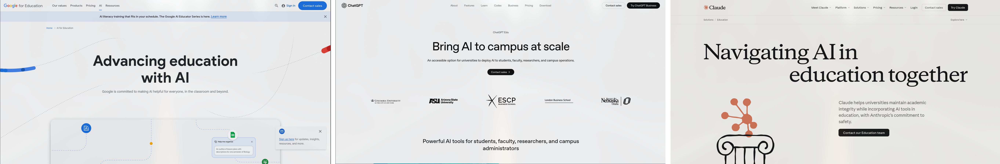

# Table of Contents

<!--incremental_lists: true-->

- Project description
- Context and Motivation
- Goals
- Approach
- Results
- Limitations and Future Work
- Conclusion / Q&A

---

# Project description

Can be described in terms of three interconnected components:

<!--incremental_lists: true-->

1. Reproducible development environment
2. An embedded AI agent
3. A curriculum-aligned configuration

<!--pause-->

All of which make use of Free and Open Source Software (FOSS) _exclusively_.

<!--
speaker_note: |
    1. A **reproducible development environment** for the students to reliably execute laboratory exercises,
    2. An **embedded AI agent** to guide them through such exercises in a step by step fashion,
    3. A **curriculum-aligned configuration** of the agent, for it to follow a pedagogical plan.
-->

---

# Context and motivation

<!--
speaker_note: Why do I care about this, and maybe you should as well.
-->

---

## Agent Harnasses


Software systems that surround an AI model, managing its context, tools, and
workflows.

<!--no_footer-->

<!--
speaker_note: |
    **Software systems built around an AI models - usually of the generative kind, such as Large Language Models -, managing its context, tools, and workflows**. That is, it provides the necessary tools that allow such models to perform tasks - that is, to become _Agentic_ -  and, with adequate setup, further do so in an efficient manner.

    Put simply, besides the conversation, the Harness provides the model with the context of a shell user session it creates for it. The model can then prompt the Harness to execute commands and read back their outputs in a way that is autonomous with regards to the user. By having direct access to the context it is meant to act upon, once initially prompted, an agent is capable of completing its task without further human intervention.

    The first such program that I've heard of was Claude Code, and it was massively influential - not to say viral, as its use popularized the term "vibe coding". Alternatives to it such as Gemini CLI and OpenAI's Codex soon emerged. Then there were IDEs that implemented harnesses front and center in their interface such as Cursor, Windsurf, Kiro, Antigravity. Now every Big Tech company is rushing to wrap their products in an Agent Harness as the default setting, be it from individual programs to the whole GUI of OSes, such as in ChromeOS, Windows and iOS.
-->

---

<!-- column_layout: [1, 1] -->

<!-- column: 0 -->


<!-- column: 1 -->

## An AI Ultimatum

How are we going to deal with the prospect of pervasive, potentially ubiquitous
interaction with AI agents?

<!-- speaker_note:|
    The issues are manyfold. In terms of privacy, ethics, pedagogy, autonomy. One might be tempted to say we should chose the best option that is offered to us by one of these previously mentioned AI companies.
    Worthy of mention:
        https://grow.google/ai-for-educators/
        https://edu.google.com/intl/ALL_us/ai/education/
-->

---

### Some pressing issues regarding the use of AI in education

<!--incremental_lists: true-->

- Plagiarism and over reliance on AI for direct solutions
- Loss of agency and capacity for critical evaluation
- Lack of contextual awareness, alignment with a pedagogical plan or goal

---

### Potentialities of developing AI _for_ education

<!--incremental_lists: true-->

- Reduced workload, greater availability
- Mitigates all the previously stated downsides
- Gives the student an opportunity to know alternatives to commercial AI usage

---

## What are the solutions currently available?

Most major AI companies do provide solutions for education.

<!--pause-->



> From left to right: Google, OpenAI, Claude

---

### Well... I don't buy it

<!--pause-->

- All are subject to vendor lock-in:
  - You can only use their own proprietary AI models;
  - They must be your providers (the ones to process your data);
  - Configuration is done through proprietary APIs with no open standards.

<!--pause-->

- All subscription based.

<!--pause-->

- All subject to _enshittification_.

---

#### Case in point

<!-- jump_to_middle -->

<!--column_layout: [ 2, 1] -->

<!--column: 0-->


<!--column: 1-->

> Google is fined in almost one million Reais after being sued by University for
> false advertising

---

<!-- column_layout: [1, 1] -->

<!-- column: 0 -->

## We carve our own path

> If the users don't control the program, the program controls the users. With
> proprietary software, there is always some entity, the "owner" of the program,
> that controls the program and through it, exercises power over its users. A
> nonfree program is a yoke, an instrument of unjust power.
>
> \- _Richard Stallman_

<!-- column: 1 -->


<!-- speaker_note:|
    We cannot enforce rules over technologies we do not control, at least not reliably. And despite the intense lobbying by Big Tech Companies, we _can_ control them.
-->

---

# Goals

<!--pause-->

1. Produce an AI agent that is not a solver of the students' exercises, but
   offers guidance following a pedagogical plan.

> Its first use case being guiding students in laboratory exercises of
> **Embedded Systems** and **Internet of Things classes**.

<!--pause-->

2. In a fully free and open source development environment.

---

# Approach

<!-- speaker_note: A three layered implementation -->

---

<!--column_layout: [1, 2]-->

<!--column: 0 -->

## 1. Reproducible Development Environment

`devenv` manages dependencies and creates a shell session where the development
environment lives.

<!--pause-->

> To the right: head of the `devenv.nix` file

<!--column: 1 -->

```nix
{ inputs, lib, pkgs, config, ... }:
let
  inherit (config.devenv) root;
  zed-local = inputs.wrappers.lib.wrapPackage {
    inherit pkgs;
    package = pkgs.zed-editor;
    runtimeInputs = [ pkgs.opencode ];
    env = {
      ZED_LOCAL = true;
      XDG_CONFIG_HOME = "${root}/.config";
    };
  };
in
{
```

---

<!--no_footer-->


> The _Learn_ agent running in Zed editor's Agent panel

---

## 2. The agent harness: Opencode

<!--column_layout: [1, 2]-->

<!--column: 0 -->

<!--incremental_lists: true-->

- Exposes tools and "skills", sets permissions

- Assigns the AI Model and connects to the provider

> To the right: head of the `Learn.md` file

<!--column: 1-->

```markdown
---

description: A teaching assistant for an introdutory Embedded Systems laboratory
mode: primary model: opencode/deepseek-v4-flash-free temperature: 0.3 color:
"#87c05f" permission: read: allow glob: allow grep: allow bash: "*": allow "awk
*": deny
```

---

### On the choice of AI model and provider

<!--incremental_lists: true-->

- Agent harnesses significantly improve the performance of smaller AI models.
- Free and Open Source models display comparable performance at a fraction of
  the cost of the proprietary Frontier models.

---

#### Comparative performance analysis


---

#### Multiple provider options


---

#### GPU farms and self-hosting


---

#### Current provider: Opencode Zen

<!--incremental_lists: true-->

- Does not require API key setup
- DeepSeek V4 Flash available for free

> [!IMPORTANT]
>
> Does store conversations to train their model.

---

<!--column_layout: [1, 2]-->

<!--column: 0-->

## 3. Skill scaffolding

Skills are markdown files providing context to the agent (usually actionable)

<!--pause-->

> To the right: some of the skills for the Embedded Systems laboratory

<!--column: 1-->

```bash
.claude
└── skills
    ├── class-selection
    │   └── SKILL.md
    ├── introduction
    │   └── SKILL.md
    ├── lab01-01-creating-a-new-project
    │   └── SKILL.md
    ├── lab01-02-sanity-check
    │   └── SKILL.md
    ├── lab04-01-sys-tick
    │   └── SKILL.md
    ├── lab04-02-general-timer
    │   └── SKILL.md
    ├── lab04-03-compare-mode
    │   └── SKILL.md
```

---

## 4. Tooling

<!--column_layout: [2, 1]-->

<!--column: 0-->

We can create programs to be used by the agent and expose them to the agent as
"tools"

<!--pause-->

> To the right: files for the implementation of a tool to send class reports

<!--column: 1-->

```bash
.opencode/scripts
├── build_payload.py
└── submit-report.sh
.claude/skills/submit-report
└── SKILL.md
.opencode/tools
└── submit-report.ts
```

---

## 5. Report server

<!--column_layout: [2, 1]-->

<!--column: 0-->


<!--column: 1-->

### Report contents

- Class summary

- User evaluation of the guidance provided

---

# Results

All development environments are **available on Github**

<!--pause-->

- **Prerequisites:** having git and devenv installed on any Unix-based OS.

<!--pause-->

- Execute the following commands to install all dependencies and launch:

  - Laboratories:

    - ES:
      `git clone https://github.com/de-abreu/es-labs.git && devenv shell start`

    - IoT:
      `git clone https://github.com/de-abreu/iot-labs.git && devenv shell start`

  - Reports:
    `git clone https://github.com/de-abreu/report-server.git && devenv up`

---

## Tests

<!--incremental_lists: true-->

- The agent was able to walk through all classes, staying on point with the
  skills provided, and producing reports.

- Inaccuracies occurred whenever the skill files were not precise enough. Most
  of the work of aligning the agent was done in fine-tuning skill files.

- Further testing is required with a larger sample to reach actionable
  conclusions.

---

# Limitations and Future Work

<!--incremental_lists: true-->

- Decoupling of the Laboratories' skills, the agent configuration , and the
  development environments

- Implementation of a solution for API key generation and handling at scale

- Compatibility with Windows, through WSL

- Finishing the implementation of a full course and conducting usability tests
  with actual students

- Publishing a Paper

# Conclusion / Q&A
