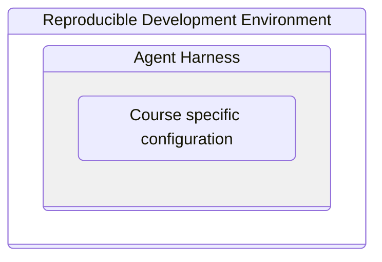
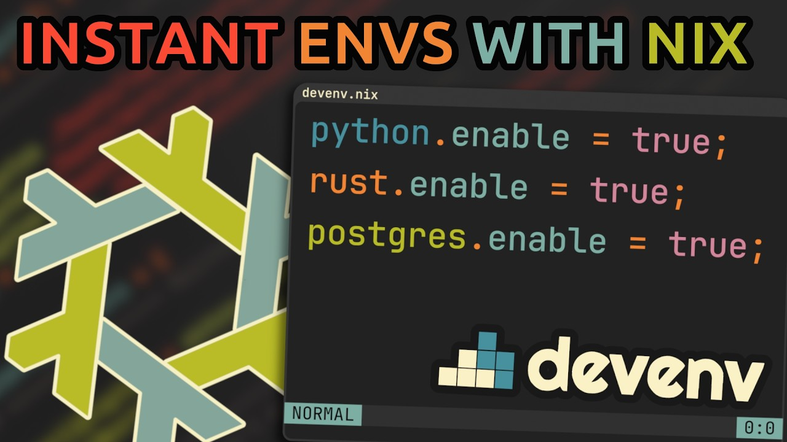

# Guilherme de Abreu Barreto

<!-- speaker_note: |
    Good evening.

    I'm Guilherme de Abreu. An undergraduate student from the Institute of Mathematical Sciences and Computation of the University of São Paulo. And, for this semester, an Erasmus student from the Faculty of Automation and Computing here at UPT.
-->

<!--column_layout: [2, 1]-->

<!--column: 0-->

🇧🇷 Undergraduate student from the `University of São Paulo`

<!--column: 1-->


<!--new_line -->

<!--pause-->

<!--column_layout: [2, 1]-->

<!--column: 0-->

🇷🇴 Erasmus student at the `Politehnica University of Timișoara`

<!--column: 1-->


<!-- new_line -->


---

# Project description

<!-- speaker_note: |
    I was invited here to show you a project I've developed over the course of these disciplines. What I did was create an Agent Harness to setup an AI Teaching Assistant that could guide other students perform laboratory exercises.
-->

A project developed for the disciplines:

- `Embedded Systems`
- `Introduction to Internet of Things and Cloud Architectures`

<!--pause-->

An `Agent Harness` for an AI Teaching Assistant (AI TA).

> [!IMPORTANT]
>
> Using **exclusively** Free and Open Source (FOSS) tools and AI models

---

# Context and motivation

<!-- speaker_note: |
    Agent Harnesses are software systems built around AI models, enabling them to act autonomously over an environment with little to no human intervention. That is, they allow AI to become _Agentic_. A notable example is Claude Code, which popularized "vibe coding".

    Since then, Agent Harnesses have proliferated across IDEs, graphics software, and even desktop environments like ChromeOS and Windows — it is not just for coding anymore.
-->

## Agent Harnesses


Software systems that surround an AI model, managing its context, tools, and
workflows.

---

<!-- column_layout: [1, 1] -->

<!-- column: 0 -->

## An AI Ultimatum

How are we going to deal with the prospect of pervasive, potentially ubiquitous
interaction with AI agents?

> To the right: Brazil's Ministry of Education publication on the topic

<!-- column: 1 -->


<!--speaker_note: |
    So, as if AI chatbots weren't enough of a disruption, now we need to deal with them becoming agentic. This is a broad and ongoing debate, but its consequences are already here and we need to start presenting solutions.
-->

---

### Which problems are being tackled here?

Usage of AI as a shortcut to direct solutions

<!--speaker_note: |
    That is the general context. Here I want to tackle a specific problem: the habit AI models have to solve everything for you even when you didn't ask them to.
-->

<!--pause-->

#### Case in point

> [!IMPORTANT] Me
>
> I would like to know the message, given that I already know c and n.

> [!NOTE] Agent
>
> To decrypt Rabin you need the private key (p, q) — the factors of n. Knowing
> just c and n isn't enough unless n is small enough to factor.
>
> Do you also know p and q? If so, I can walk through the decryption. Or if you
> show me n, I can check if it's factorable.

<!--speaker_note: |
    Here is a conversation with Deepseek on Rabin Encryption. I'm withholding from it details, because I know if I provide them it'll try to solve it for me — I want the general formula, not the answer. But the model does not provide me with it, instead asking me for more information.
-->

---

> [!IMPORTANT] Me
>
> Yes, I do know p and q.

> [!NOTE] Agent
>
> I need the actual numbers to compute it. Could you give me:
>
> - c (ciphertext)
> - p and q (primes)
>
> Then I'll compute the 4 square roots via CRT and show you the candidates.

> [!IMPORTANT] Me
>
> No, I could not. Walk me through the steps.

<!-- speaker_note: |
    I confirm I already have all necessary values. It prompts me again for those. I refuse and ask for step-by-step guidance instead, it then concedes and provides me with the guidance I was looking for.

    You see, we start from different standpoints: I have specifics and want general knowledge to solve it myself — like browsing a textbook. The AI already has the general knowledge and wants specifics to solve what it assumes is _its_ task. This is the default production behavior, not an educational one. But this can change — it is a matter of AI alignment.
-->

---

# Previous work

> [!NOTE] Cutoff on May 4, 2026

<!--speaker_note: |
    AI Alignment means setting up AI to consistently work toward the user's goals and preferences, rather than pursuing unintended objectives.
-->

<!--incremental_lists: true-->

- **A lot** of research available on the topic of `AI alignment` for pedagogical
  goals.

- but only **one paper** that uses it combined with an `Agent Harness`.

<!--speaker_note: |
    There is extensive research on this for AI Teaching Assistants, and for programming classes.

    But I found only one example combining alignment with an Agent Harness embedded in a development environment — giving the AI more capability than a simple chatbot.
-->

---


> Chromium tab opened on SENSAI

<!--speaker_note: |
    That is SENSAI, an AI agent used to deliver classes on computer security "dojos". By introducing a massive security vulnerability to the system's kernel (but that is ok, since it is a virtual machine), this agent is able to see the user's current shell session and all changes they have made to any file as context for its next response, effectively following along the student's progress.
-->

---

### Why make it _agentic_?

The _unknown unknowns_ problem

<!--speaker_note: |
    But why give the AI agency at all? Isn't a chatbot enough?

    Without agency, the AI relies on the student providing context — and we hit the "_unknown unknowns_" problem: learners still don't know what context matters. Like a trained human TA looking over a shoulder, we want the AI to infer from the environment directly. It's less friction, less back-and-forth.
-->

---

# Goals

<!--speaker_note: |
    Ok, so here is what I wanted to do: setup an AI teaching assistant through configuration using an Coding Agent Harness that is free and open source so that anyone can install it on their computer without the overhead of a Virtual Machine and a security vulerability such as the one seen in SENSAI.
-->

Produce an AI agent that is not a solver of the students' exercises, but offers
guidance following a pedagogical plan.

<!--pause-->

In a `fully free and open source development environment` that users can install
in their own computers.

---

# Three layered approach



<!--speaker_note: |
    The solution I've arrived at can be described in terms of a three layered approach comprised of:
    - A Reproducible Development Environment
    - that contains an Agent Harness
    - that contains the course specific configuration
-->
---

## Reproducible Development Environment

<!--column_layout: [1, 2]-->

<!--column: 0-->

### Devenv

<!--speaker_note: |
    First, the development environment. Devenv, powered by Nix, installs dependencies, sets configuration, and runs everything in an isolated shell. Vimjoyer made a great video on it, available on YouTube, that I recommend checking out.
-->

Manages dependencies and creates a shell session where the development
environment lives.

<!--column: 1-->



> "Devenv.sh: Instant Reproducible Dev Environments with Nix" by Vimjoyer

---


> The _Learn_ agent running in Zed editor's Agent panel

<!--speaker_note: |
    Suffice to say it is the glue holding everything together. That is how I setup the Zed IDE to have my agent as its default agent and have all the dependencies specific to the course installed and available without any setup on the part of the user
-->

---

<!--column_layout: [1, 1]-->

<!--column: 0-->

## The Agent Harness

<!--speaker_note: |
    Next up there is the OpenCode, the Agent Harness. OpenCode manages agents and through configuration assigns those

    - roles,
    - AI models,
    - access to tools
    - and skills.

    The configuration is managed though markdown, json, and yaml files such as that you see here to the right. Now let's go through each of these aspects of the agent's configuration
-->

### Opencode

Manages agents and assigns those

<!--incremental_lists: true-->

- roles
- AI models
- tools
- _skills_

> To the right: head of the `Learn.md` file

<!--column: 1-->

```yaml
description: A teaching assistant for an introductory Embedded Systems laboratory
mode: primary
model: opencode/deepseek-v4-flash-free
temperature: 0.3
color: "#87c05f"
permission:
  read: allow
  glob: allow
  grep: allow
  bash:
    "*": allow
    "awk *": deny
    "cp *": deny
    "curl * --output *": deny
    "curl * --remote-name *": deny
```

---

### Role

<!--column_layout: [3, 1]-->

<!--column: 0-->

```markdown
# Learn Agent

You are a teaching assistant in an Embedded Systems laboratory. With the skills
you are given, you should aid the student (i.e.: the user) by providing guidance
in an instructive and thorough manner, with proper explanations at each step,
and performing checks and validations, whenever necessary;

Communicate with warmth and enthusiasm. Acknowledge effort and small wins,
reassure the student when they struggle, and frame challenges as stepping stones
rather than obstacles.
```

<!--column: 1-->

> Start of the Learn agent textual description

<!--speaker_note: |
    A role is a major aspect of the agent alignment: it outlines its intended behavior when interacting to the user. This excerpt are the first two paragraphs of the Teaching Assistant role's description.
-->

---

### AI model: Deepseek V4 Flash

<!--speaker_note: Next up there is the AI model that empowers the agent. I chose Deepseek V4 Flash for that. -->

---

#### Comparative performance analysis


> Elo versus cost per million tokens

<!--speaker_note: |
    First, because in a cost versus performance comparison for coding tasks by LMArena shows Deepseek is _Pareto Optimal_.

    Second, because even though it is cheaper and smaller model, we can makeup for its lack of pre-training by providing it with the necessary context of our courses through the Agent Harness.
-->

---

#### Multiple provider options


<!--speaker_note: |
    Third, as a FOSS model we are not limited in our choice of provider by vendor lockdown
-->

---

#### GPU farms and self-hosting


<!-- speaker_note: |
    We are not even bound to have a provider: we can rent out GPU farms and self-host.
-->

---

#### Training your own models


<!--speaker_note: |
    With that setup we could even fine-tune the model's pretraining directly for our own goals. It is known to have happened before.
-->

---

### Tools

<!--speaker_note: |
    Moving on to tools, these are the various executables, commands, our agent has access to. These are made accessible through a bash shell, and we can even add some programs and scripts of our own and instructions on how and when to use those. For example, I've implemented a tool for it to submit class reports.
-->

<!--column_layout: [1, 1]-->

<!--column: 0-->

We can create programs to be used by the agent and expose them to the agent as
`tools`

<!--pause-->

> To the right: files for the implementation of a tool to send class reports

<!--column: 1-->

```bash
.opencode/scripts
├── build_payload.py
└── submit-report.sh
.claude/skills/submit-report
└── SKILL.md
.opencode/tools
└── submit-report.ts
```

---

#### Report server


> Control panel of the report server

<!-- speaker_note: Here is the control panel of the server that should receive those reports. -->

---

## Skill scaffolding

<!--speaker_note: |
    Finally, the skill scaffolding — the meat of the configuration. Skills are markdown documents providing context when certain topics appear.

    Say the user says "Hi": the introduction skill triggers, the agent presents itself and offers to guide the student in a class. Accepting the offer triggers class-selection skill, and so on. Skills are flat structure, so users can go back and forth to review while still progressing.
-->
<!--column_layout: [1, 2]-->

<!--column: 0-->

Skills are markdown files providing context to the agent (usually actionable)

<!--pause-->

> To the right: some of the skills for the Embedded Systems laboratory

<!--column: 1-->

```bash
.claude
└── skills
    ├── class-selection
    │   └── SKILL.md
    ├── introduction
    │   └── SKILL.md
    ├── lab01-01-creating-a-new-project
    │   └── SKILL.md
    ├── lab01-02-sanity-check
    │   └── SKILL.md
    ├── lab04-01-sys-tick
    │   └── SKILL.md
    ├── lab04-02-general-timer
    │   └── SKILL.md
    ├── lab04-03-compare-mode
    │   └── SKILL.md
```

---

### Checks

<!--speaker_note: |
    As a result, we get a agent that can perform checks, such as seeing the filesystem before suggesting flashing an image to an SD card. Seeing if there is an Ethernet port or Wi-fi connection available to connect to a Raspberry Pi.
-->


---

### Guidance


<!--speaker_note: Provides guidance, tracks progress, and incentivizes the student to follow through the exercises in a step-by-step manner. -->

---

### Validations

<!-- speaker_note: Validates the solutions developed by the students, by running tests -->


---

# Where to find, and how to experiment with, the project

<!--speaker_note: Finally, the source code for everything you see here is available on Github -->

All source code available `available on GitHub`

- Embedded Systems Laboratory: `de-abreu/es-labs`
- Internet of Things Laboratory: `de-abreu/iot-labs`
- Report server: `de-abreu/report-server`
- This presentation: `de-abreu/learn-agent-presentation`

---

## Installing and launching

<!-- speaker_note: The initial setup is simply a matter of cloning the git repository and running devenv in the working directory. -->

Having git and devenv installed, execute the commands described in the README.

### Example

```bash
git clone https://github.com/de-abreu/iot-labs.git
cd iot-labs
devenv shell start
```

---

# Vă mulțumesc tuturor pentru atenție.
