# And you are...

## Guilherme de Abreu Barreto


<!--column_layout: [3, 1]-->

<!--column: 0-->

🇧🇷 Undergraduate student from the `University of São Paulo`

<!--column: 1-->


---

<!--column_layout: [3, 1]-->

<!--column: 0-->

🇷🇴 Erasmus student at the `Politehnica University of Timișoara`

<!--column: 1-->


<!--end_slide-->

# Project description

An `Agent Harness` for an AI Teaching Assistant, for laboratory exercises on

- Embedded Systems

- Internet of Things

<!--pause-->

> [!IMPORTANT]
>
> Using **exclusively** Free and Open Source tools and AI models

<!--end_slide-->

# Context and motivation

## Agent Harnesses

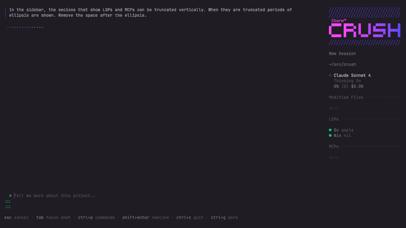

Software systems that surround an AI model, managing its context, tools, and
workflows.

<!--no_footer-->

<!--
speaker_note: |
    **Software systems built around an AI models - usually of the generative kind, such as Large Language Models -, managing its context, tools, and workflows**. That is, it provides the necessary tools that allow such models to perform tasks - that is, to become _Agentic_ -  and, with adequate setup, further do so in an efficient manner.

    Put simply, besides the conversation, the Harness provides the model with the context of a shell user session it creates for it. The model can then prompt the Harness to execute commands and read back their outputs in a way that is autonomous with regards to the user. By having direct access to the context it is meant to act upon, once initially prompted, an agent is capable of completing its task without further human intervention.

    The first such program that I've heard of was Claude Code, and it was massively influential - not to say viral, as its use popularized the term "vibe coding". Alternatives to it such as Gemini CLI and OpenAI's Codex soon emerged. Then there were IDEs that implemented harnesses front and center in their interface such as Cursor, Windsurf, Kiro, Antigravity. Now every Big Tech company is rushing to wrap their products in an Agent Harness as the default setting, be it from individual programs to the whole GUI of OSes, such as in ChromeOS, Windows and iOS.
-->

<!--end_slide-->

<!-- column_layout: [1, 1] -->

<!-- column: 0 -->

## An AI Ultimatum

How are we going to deal with the prospect of pervasive, potentially ubiquitous
interaction with AI agents?

> To the right: Brazil's Ministry of Education publication on the topic

<!-- column: 1 -->

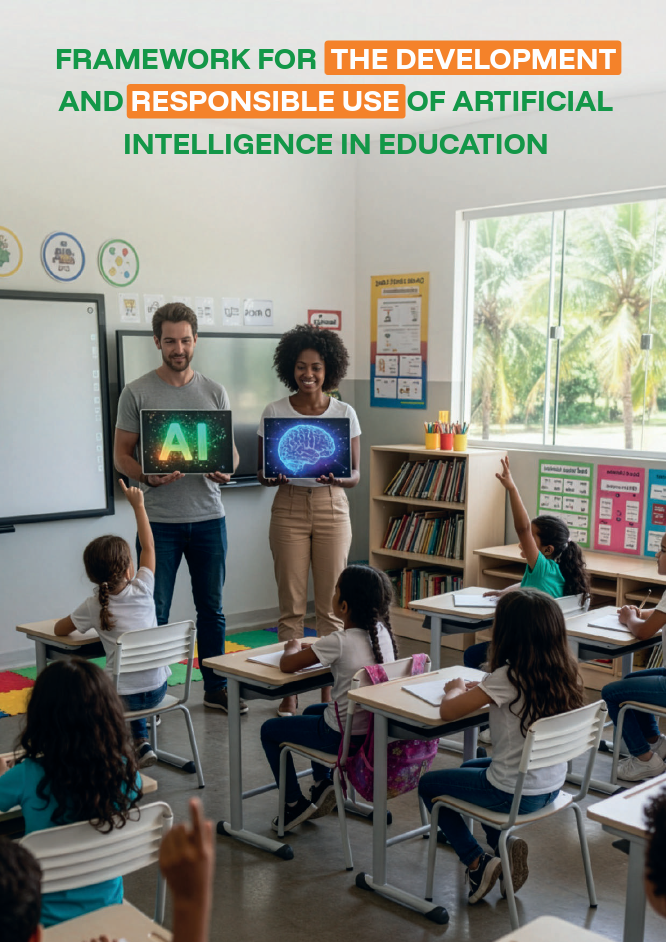

<!--end_slide-->

### Pressing issues regarding the use of AI in education

<!--pause-->

#### Main Issue

Usage of AI as a shortcut to direct solutions

<!--pause-->

##### Symptoms

<!--incremental_lists: true-->

- Loss of agency and capacity for critical evaluation
- Lack of contextual awareness, alignment with a pedagogical plan or goal

<!--end_slide-->

###### Case in point

> [!IMPORTANT] Me
>
> I would like to know the message, given that I already know c and n.

> [!NOTE] Agent
>
> To decrypt Rabin you need the private key (p, q) — the factors of n. Knowing
> just c and n isn't enough unless n is small enough to factor.
>
> Do you also know p and q? If so, I can walk through the decryption. Or if you
> show me n, I can check if it's factorable.

> [!IMPORTANT] Me
>
> Yes, I do know p and q.

<!--end_slide-->

###### Case in point

> [!NOTE] Agent
>
> I need the actual numbers to compute it. Could you give me:
>
> - c (ciphertext)
> - p and q (primes)
>
> Then I'll compute the 4 square roots via CRT and show you the candidates.

> [!IMPORTANT] Me
>
> No, I could not. Walk me through the steps.

<!--end_slide-->

### Potentialities of developing AI _for_ education

<!--incremental_lists: true-->

1. Tackle the issues brought about by AI
2. Reduced workload for educators, greater availability and scalability for
   students
3. Gives the student an opportunity to know alternatives to commercial AI usage

<!--end_slide-->

# Previous work

> [!NOTE] Cutoff on May 4, 2026

<!--incremental_lists: true-->

- `A lot of` literature and empirical research on the topic of alignment of
  _Large Language Models_ with pedagogical goals and student preferences.

- Just `one paper` on the use of an Agent Harness (called SENSAI) for a computer
  security "dojo".

<!--end_slide-->

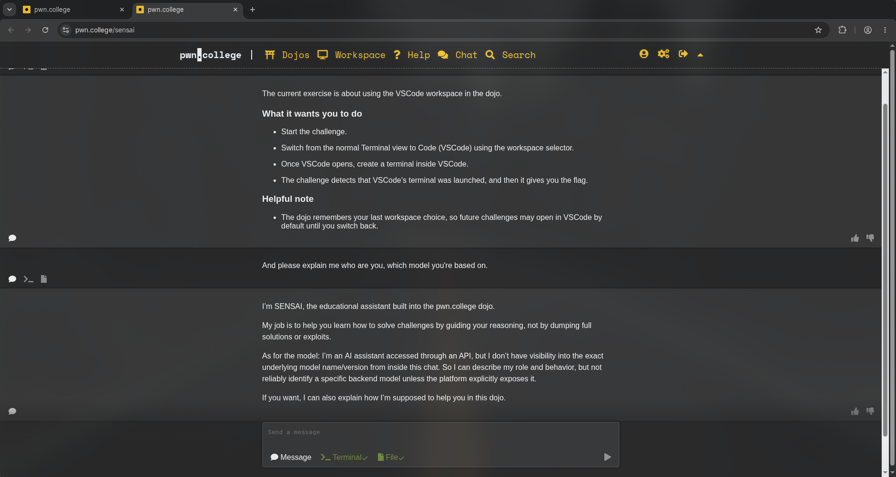

> Chromium tab opened on SENSAI

<!--end_slide-->

### Why is it important for it to be _agentic_?

<!--incremental_lists: true-->

- Solves the "_unknown unknowns_" problem.
- It's less friction overall.

<!--end_slide-->

# Goals

Produce an AI agent that is not a solver of the students' exercises, but offers
guidance following a pedagogical plan.

<!--pause-->

In a `fully free and open source development environment` that users can install
in their own computers.

<!--end_slide-->

# Three layered approach

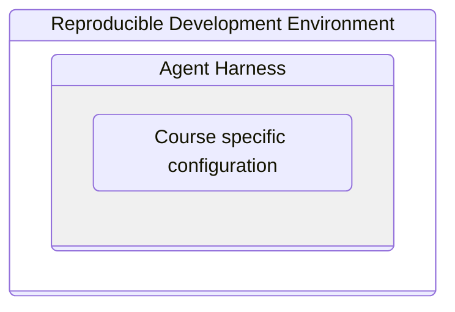

<!--end_slide-->

## Reproducible Development Environment

<!--column_layout: [1, 2]-->

<!--column: 0-->

### Devenv

Manages dependencies and creates a shell session where the development
environment lives.

<!--pause-->

> To the right: head of the `devenv.nix` file

<!--column: 1-->

```nix
{ inputs, lib, pkgs, config, ... }:
let
  inherit (config.devenv) root;
  zed-local = inputs.wrappers.lib.wrapPackage {
    inherit pkgs;
    package = pkgs.zed-editor;
    runtimeInputs = [ pkgs.opencode ];
    env = {
      ZED_LOCAL = true;
      XDG_CONFIG_HOME = "${root}/.config";
    };
  };
in
{
```

<!--end_slide-->

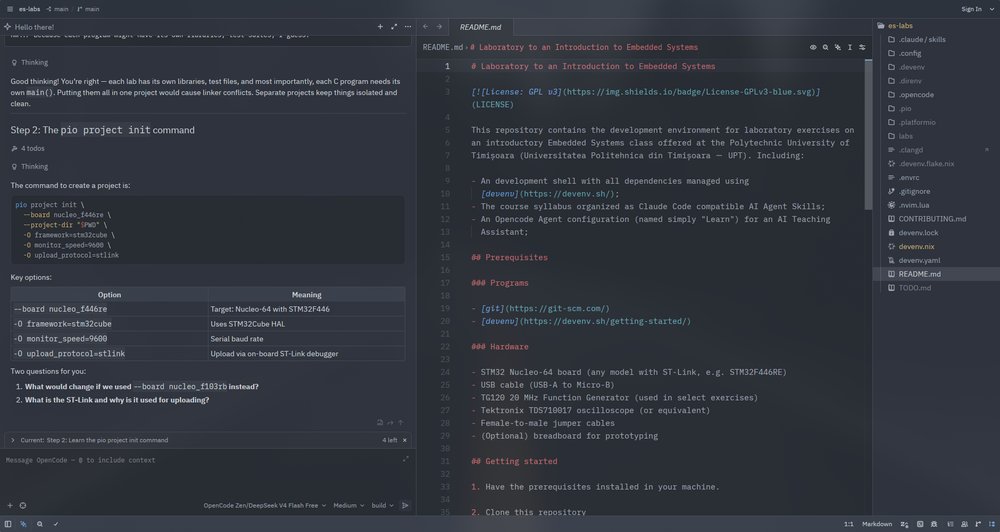

> The _Learn_ agent running in Zed editor's Agent panel

<!--end_slide-->

<!--column_layout: [1, 1]-->

<!--column: 0-->

## The Agent Harness

### Opencode

Manages agents and assigns those

<!--incremental_lists: true-->

- roles
- AI models
- tools
- _skills_

<!--pause-->

> To the right: head of the `Learn.md` file

<!--column: 1-->

```yaml
description: A teaching assistant for an introductory Embedded Systems laboratory
mode: primary
model: opencode/deepseek-v4-flash-free
temperature: 0.3
color: "#87c05f"
permission:
  read: allow
  glob: allow
  grep: allow
  bash:
    "*": allow
    "awk *": deny
    "cp *": deny
    "curl * --output *": deny
    "curl * --remote-name *": deny
```

<!--end_slide-->

### Role

<!--column_layout: [3, 1]-->

<!--column: 0-->

```markdown
# Learn Agent

You are a teaching assistant in an Embedded Systems laboratory. With the skills you are given, you should aid the student (i.e.: the user) by providing guidance in an instructive and thorough manner, with proper explanations at each step, and performing checks and validations, whenever necessary;

Communicate with warmth and enthusiasm. Acknowledge effort and small wins, reassure the student when they struggle, and frame challenges as stepping stones rather than obstacles.
```

<!--column: 1-->

> Start of the Learn agent textual description

<!--end_slide-->

### AI model

<!--incremental_lists: true-->

- Agent harnesses significantly improve the performance of smaller AI models.
- Free and Open Source models display comparable performance at a fraction of
  the cost of the proprietary Frontier models.

<!--end_slide-->

#### Comparative performance analysis

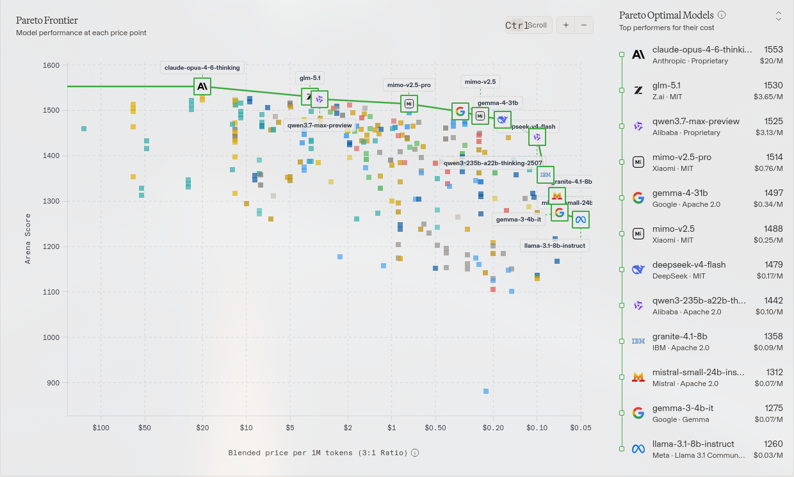

> Elo versus cost per million tokens

<!--end_slide-->

#### Multiple provider options

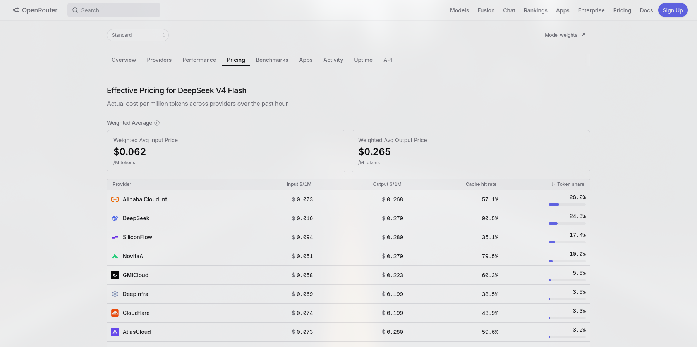

<!--end_slide-->

#### GPU farms and self-hosting


<!--end_slide-->

#### Training your own models

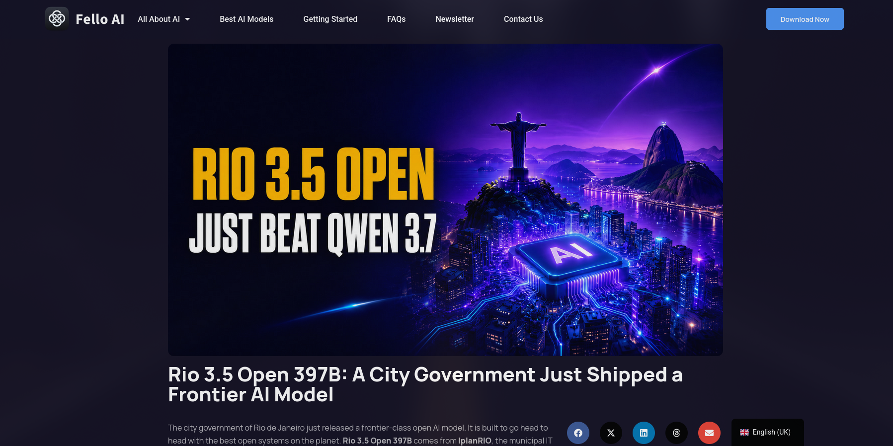

<!--end_slide-->

### Tools

<!--column_layout: [1, 1]-->

<!--column: 0-->

We can create programs to be used by the agent and expose them to the agent as
`tools`

<!--pause-->

> To the right: files for the implementation of a tool to send class reports

<!--column: 1-->

```bash
.opencode/scripts
├── build_payload.py
└── submit-report.sh
.claude/skills/submit-report
└── SKILL.md
.opencode/tools
└── submit-report.ts
```

<!--end_slide-->

#### Report server

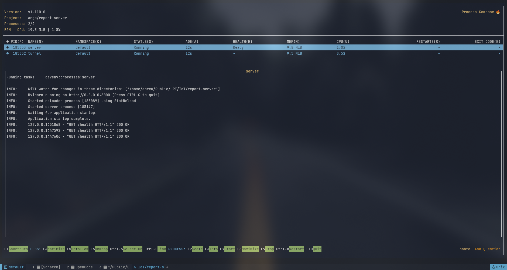

> Control panel of the report server

<!--end_slide-->

## Skill scaffolding

<!--column_layout: [1, 2]-->

<!--column: 0-->

Skills are markdown files providing context to the agent (usually actionable)

<!--pause-->

> To the right: some of the skills for the Embedded Systems laboratory

<!--column: 1-->

```bash
.claude
└── skills
    ├── class-selection
    │   └── SKILL.md
    ├── introduction
    │   └── SKILL.md
    ├── lab01-01-creating-a-new-project
    │   └── SKILL.md
    ├── lab01-02-sanity-check
    │   └── SKILL.md
    ├── lab04-01-sys-tick
    │   └── SKILL.md
    ├── lab04-02-general-timer
    │   └── SKILL.md
    ├── lab04-03-compare-mode
    │   └── SKILL.md
```

<!--end_slide-->

### Checks

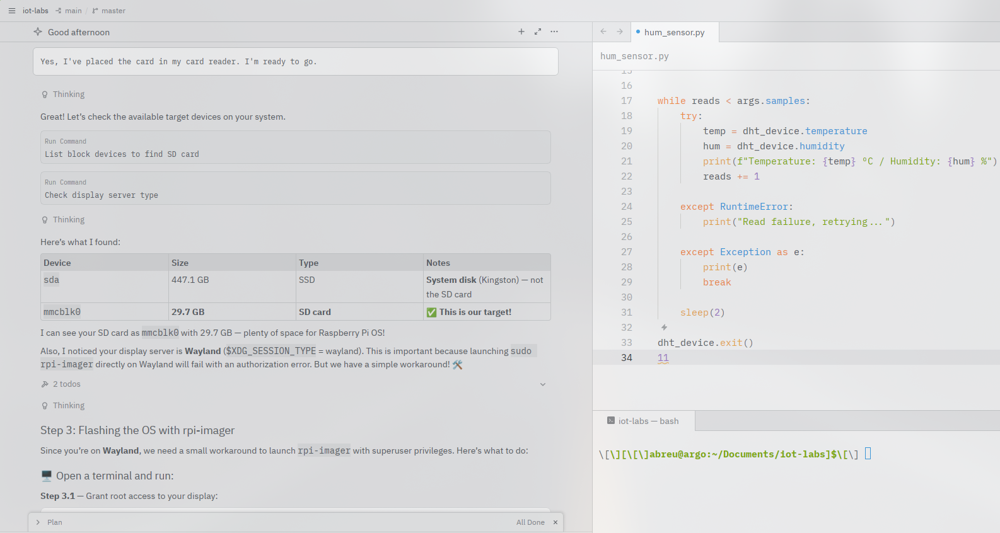

<!--end_slide-->

### Validations

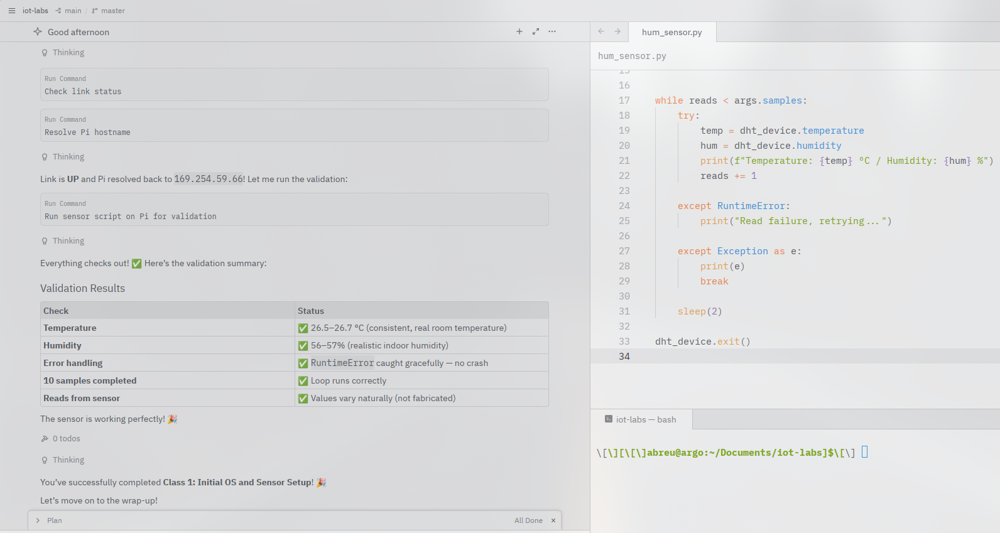

<!--end_slide-->

### Guidance

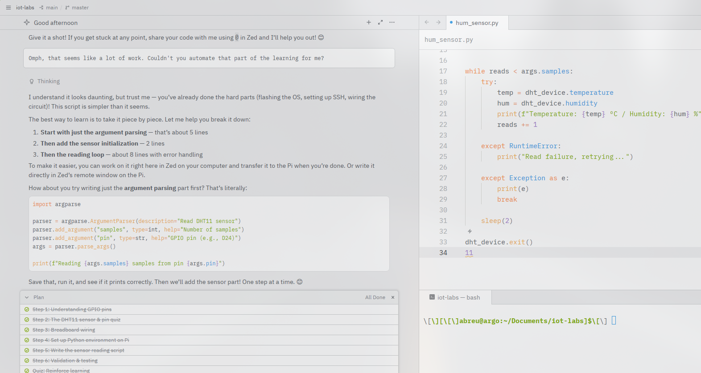

<!--end_slide-->

# Where to find, and how to experiment with, the project

<!--pause-->

All development environments are `available on GitHub`

- Embedded Systems Laboratory: `de-abreu/es-labs`
- Internet of Things Laboratory: `de-abreu/iot-labs`
- Report server: `de-abreu/report-server`

<!--end_slide-->

## Installing and launching

**Prerequisites:** having git and devenv installed on any Unix-based OS.

Execute the following commands (applying the substitutions):

```bash
git clone https://github.com/de-abreu/<repo-name>.git
cd <repo-name>
devenv <shell start|up>
```

> "`up`" for the report server, "`shell start`" for the others

<!--end_slide-->

# Results

<!--incremental_lists: true-->

- The agent was able to walk through all classes, staying on point with the
  skills provided, and producing reports by the end of each class.

- Inaccuracies occurred whenever the skill files were not precise enough. Most
  of the work of aligning the agent was done in fine-tuning skill files.

- Further testing is required with a larger sample to reach actionable
  conclusions.

<!--end_slide-->

# Vă mulțumesc tuturor pentru atenție.
